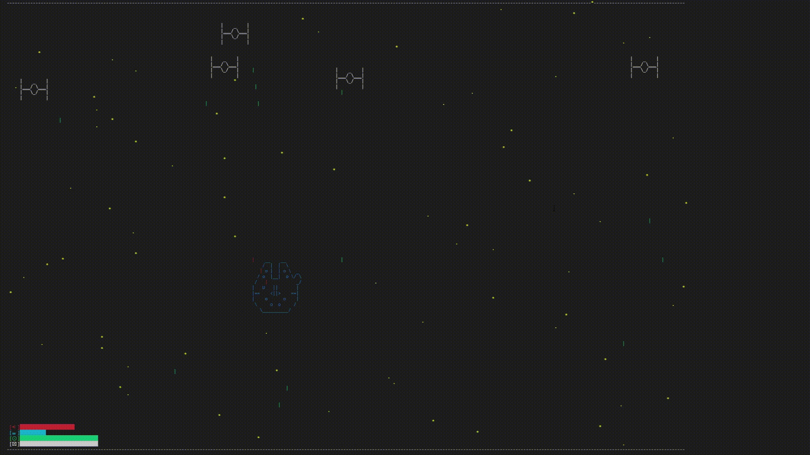
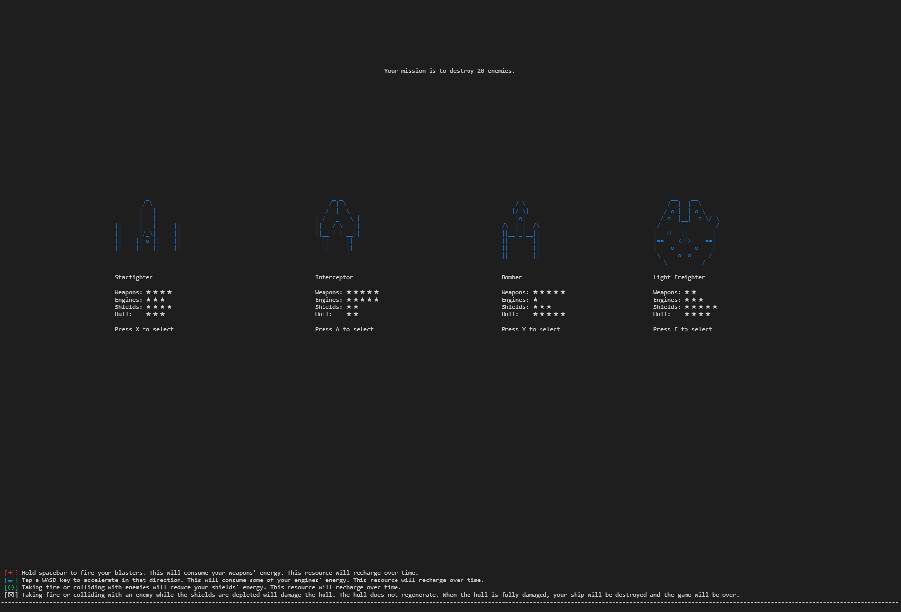

## Dale Andreoli
and17081@byui.edu

# Python Game Project
This project uses the Python library, Asciimatics, to handle the input and output for a 2D game. The player selects their ship and tries to dsetroy enemy ships while avoiding damage. The game ends when the player is destroyed or all enemies are defeated.





This project aims to demonstrate the following principles of Object Oriented Programming:
* Abstraction
* Encapsulation
* Inheritance
* Polymorphism

Many of the classes in this project are based off a theater analogy in which a cast of actors that follow a script of actions to accomplish the main game loop.

# Installation
This project uses the [Asciimatics](https://asciimatics.readthedocs.io/en/stable/intro.html) library to handle input and output. 

Asciimatics supports Python versions 2 and 3.

To install Asciimatics, simply install with pip. If necessary, see the [Asciimatics Installation Page](https://asciimatics.readthedocs.io/en/stable/intro.html#installation) for further instructions.

```
$ pip install asciimatics
```

# Configure Your Output Terminal

This project uses the output terminal to display a screen 260 characters wide and 80 characters tall. This can exceed default terminal settings and prevent the game from rendering properly.

To make the game more visible, you will likely need to resize your terminal to take up as much of the screen as possible.

In VS Code, you can adjust your output terminal font size in your settings.json file. To find your settings file, in VS Code:
1. Open the Command Pallette ( Windows: Ctrl + Shift + P, MacOS: Command + Shift + P )
2. Search for "Open Settings (JSON)" and hit enter to open the settings file.
3. Add the following line to set your output terminal font to size 12. Be sure to add a comma after the line that was previously the bottom setting.
```
"terminal.integrated.fontSize": 12 // Default 14
```
You may want to set your font size smaller or larger depending on your screen resolution and size.